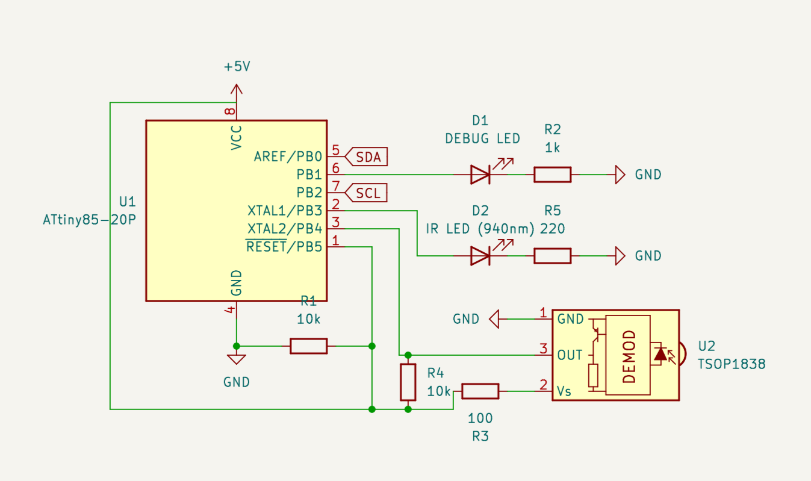

# IR-remote-I2C

Work in progress.

IR remote controller exposed through I2C, primarily for Attiny85.
The controller is configured as an I2C slave with the address 0x8:
- when data is written to it, data will be transmitted on IR_SEND_PIN (NEC protocol)
- when data is read from it, the last captured signal on IR_RECV_PIN is returned (NEC protocol)

Due to the limited memory, only NEC protocol is supported as of now.

Used libraries:
- Wire.h (v1.5.2)
- IRremote.h (v4.1.0)

Suggestions and fixes are welcome.

